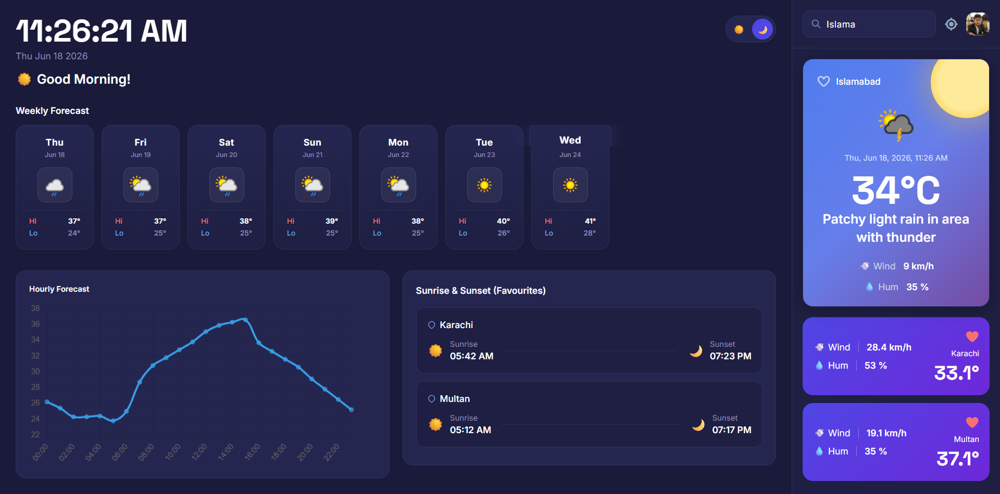
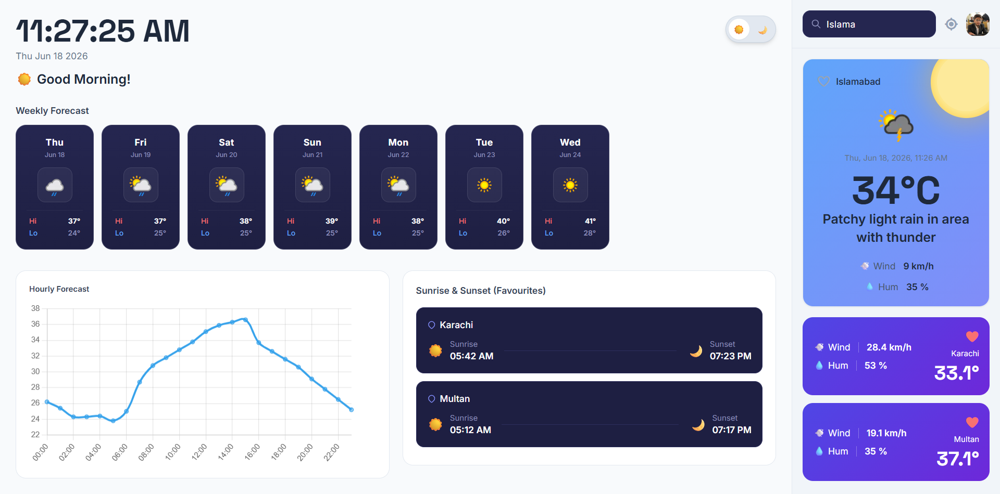
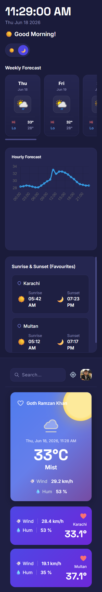
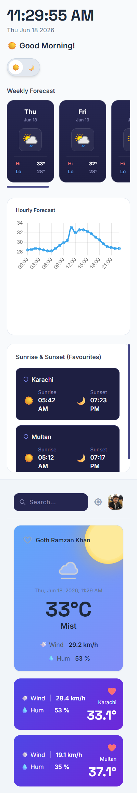

# Weather Dashboard App — Frontend Development Capstone Project

This is a solution to the **Weather Dashboard App** capstone project assigned during the **Frontend Development Training Program** (HTML, CSS, Bootstrap, Tailwind CSS, JavaScript module).

## Table of Contents

- [Overview](#overview)
  - [The Challenge](#the-challenge)
  - [Screenshot](#screenshot)
  - [Links](#links)
- [My Process](#my-process)
  - [Built With](#built-with)
  - [Project Structure](#project-structure)
  - [Feature Completion](#feature-completion)
  - [What I Learned](#what-i-learned)
  - [Continued Development](#continued-development)
  - [Useful Resources](#useful-resources)
  - [AI Collaboration](#ai-collaboration)
- [Author](#author)
- [Acknowledgments](#acknowledgments)

---

## Overview

### The Challenge

Users should be able to:

- Search weather information for any city using a debounced search bar
- View current weather details: temperature, condition, wind speed, humidity, and weather icon
- See a 7-day weather forecast with daily high/low temperatures and condition icons
- Auto-detect their location using the browser Geolocation API
- View an interactive hourly temperature chart powered by Chart.js
- Save favourite cities to LocalStorage and reload their weather with a single click
- Remove cities from favourites
- View sunrise and sunset times for saved favourite cities
- Receive real-time feedback via a stacked toast notification system (success, error, info, warning)
- See animated loading skeleton placeholders while data is being fetched
- Toggle between Light Mode and Dark Mode

### Screenshot







### Links

- **Repository URL:** [https://github.com/Moinuddin2003/Weather-Dashboard-App](https://github.com/Moinuddin2003/Weather-Dashboard-App)
- **Live Site URL:** [https://moinuddin2003.github.io/Weather-Dashboard-App/](https://moinuddin2003.github.io/Weather-Dashboard-App/)

---

## My Process

### Built With

- Semantic HTML5 markup
- Tailwind CSS (via CDN — no build tools required)
- Vanilla JavaScript (ES6+)
- Mobile-first responsive workflow
- [WeatherAPI.com](https://www.weatherapi.com/) — Live weather and forecast data
- [Chart.js](https://www.chartjs.org/) (via CDN) — Hourly temperature chart
- [Font Awesome](https://fontawesome.com/) — Icons
- [Google Fonts](https://fonts.google.com/) — Inter & Space Grotesk
- LocalStorage API — Favourites persistence
- Geolocation API — Auto-detect user location

---

### Project Structure

```
weather-dashboard/
│
├── index.html          # Main HTML structure
├── script.js           # All JavaScript logic
├── config.js           # API key configuration (not committed)
├── styles.css          # Custom CSS overrides
├── assets/
│   ├── Moin.jpg
│   └── screenshots/
│       ├── desktop.png
│       └── mobile.png
│
└── README.md
```

---

### Feature Completion

- [x] City Search with Debouncing (1000ms delay)
- [x] Current Weather Card (city, temp, condition, wind, humidity, icon)
- [x] 7-Day Weekly Forecast Strip
- [x] Geolocation Support (auto-detect + permission denial handling)
- [x] Hourly Temperature Chart (Chart.js line chart)
- [x] Favourites System (add / remove)
- [x] LocalStorage Integration (favourites persistence)
- [x] Sunrise & Sunset display for favourite cities
- [x] Toast Notification System (success, error, info, warning — stacked)
- [x] Loading Skeletons (weather card + chart + favourites)
- [x] Light / Dark Mode Toggle
- [x] Responsive Design (mobile, tablet, desktop)
- [x] API key stored separately in `config.js`

---

### What I Learned

This project gave me hands-on experience with real-world frontend development patterns that go well beyond basic HTML and CSS.

**Debounced search** — Instead of firing an API request on every keystroke, I used `setTimeout` and `clearTimeout` to delay the request until the user finishes typing:

```js
let debounceTimer;

searchWeather.addEventListener("input", (event) => {
  const cityName = event.target.value.trim();
  if (cityName.length === 0) return;

  clearTimeout(debounceTimer);
  debounceTimer = setTimeout(() => {
    fetchWeatherData(cityName);
  }, 1000);
});
```

**Reusable API helper** — Rather than writing repetitive try/catch blocks, I created one centralised fetch function used throughout the app:

```js
async function fetchAPI(
  BASE_URL,
  customErrorMessage = "Data load nahi ho rha",
) {
  try {
    const response = await fetch(BASE_URL);
    if (!response.ok) throw new Error(customErrorMessage);
    return await response.json();
  } catch (error) {
    showToast("Error!", error.message, "❌", "error");
    console.error(`Error Details: ${error}`);
    return null;
  }
}
```

**Dynamic toast notification system** — Toasts are created dynamically and auto-removed after 3 seconds, and multiple toasts can stack simultaneously:

```js
function showToast(title, description, icon, type) {
  const toastDiv = document.createElement("div");
  toastDiv.className = `p-4 rounded-xl border shadow-lg flex items-start gap-3 transition-all duration-300 ${typeClasses[type]}`;
  toastDiv.innerHTML = `
    <div class="text-xl">${icon}</div>
    <div class="flex flex-col gap-0.5">
      <h4 class="font-bold text-sm">${title}</h4>
      <p class="text-xs opacity-90">${description}</p>
    </div>
  `;
  document.getElementById("toast-container").appendChild(toastDiv);
  setTimeout(() => toastDiv.remove(), 3000);
}
```

**Chart.js integration** — I used the existing chart instance check to destroy and rebuild the chart whenever new city data loads, preventing canvas conflicts:

```js
if (hourlyChart) hourlyChart.destroy();
hourlyChart = new Chart(ctx, { ... });
```

---

### Continued Development

Areas I want to continue improving in future projects:

- Persisting dark mode preference using LocalStorage so the theme is remembered on page reload
- Adding a dedicated error screen with a visible **Retry** button for failed API calls
- Implementing unit switching between °C and °F
- Adding a recent search history feature
- Improving accessibility (keyboard navigation, ARIA labels)
- Progressive Web App (PWA) support for offline use
- Weather alerts and air quality index integration

---

### Useful Resources

- [WeatherAPI Documentation](https://www.weatherapi.com/docs/) — Used for current weather, forecast, and astro data endpoints
- [Chart.js Documentation](https://www.chartjs.org/docs/latest/) — Helped with building the hourly temperature line chart
- [Tailwind CSS Documentation](https://tailwindcss.com/docs) — Used for all responsive layout and utility class decisions
- [MDN Web Docs — Fetch API](https://developer.mozilla.org/en-US/docs/Web/API/Fetch_API) — Referenced for async data fetching patterns
- [MDN Web Docs — Geolocation API](https://developer.mozilla.org/en-US/docs/Web/API/Geolocation_API) — Used for implementing location-based weather

---

### AI Collaboration

AI tools were used as a learning companion throughout this project.

**Tool Used**

- ChatGPT

**How It Helped**

- Asking concept-based questions instead of requesting direct solutions
- Understanding how APIs work and how to structure async JavaScript
- Clarifying how LocalStorage, Geolocation, and Chart.js work under the hood
- Reviewing my own code after I wrote it and suggesting improvements
- Helping me think through problems without giving away the answer

**Development Approach**

I intentionally used AI as a Socratic learning tool rather than a code generator.
When stuck, I described my problem and asked for explanations or hints — not
complete solutions. The JavaScript logic, DOM manipulation, API integration, and
overall implementation were worked out by me, with AI helping me understand the
"why" behind concepts rather than handing me the "what."

---

## Author

**Muhammad Moinuddin**  
Frontend Development Trainee

- GitHub — [@Moinuddin2003](https://github.com/Moinuddin2003)

---

## Acknowledgments

Special thanks to **Ashir Azeem** for designing and assigning this capstone project as part of the Frontend Development Training Program. The project provided genuine hands-on experience in API integration, asynchronous JavaScript, responsive UI design, and real-world frontend application architecture.
